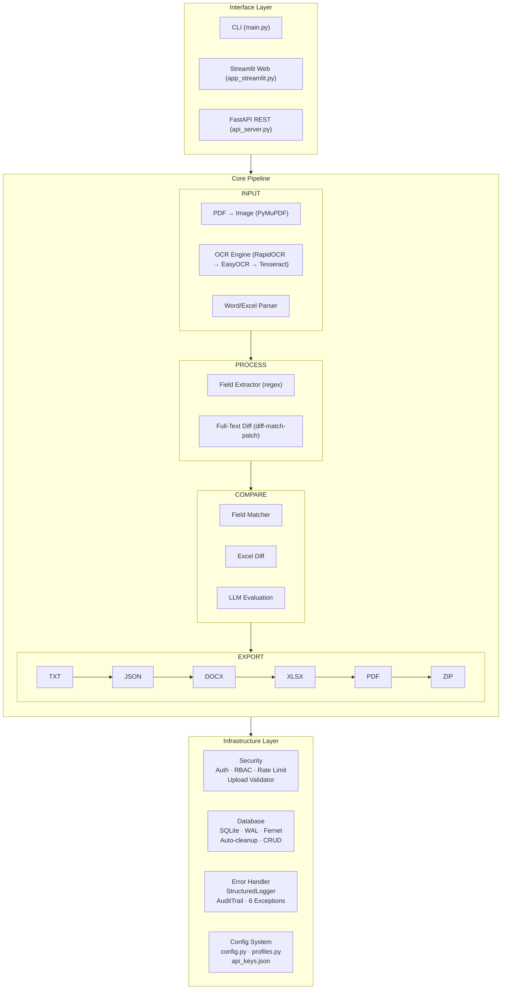
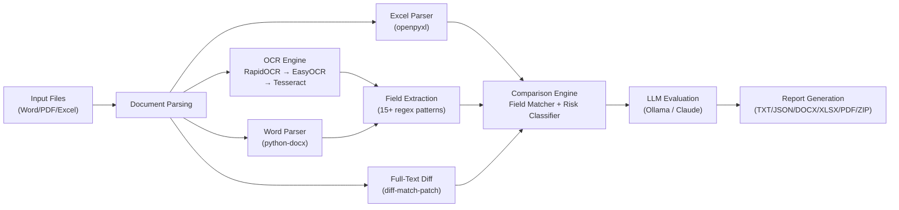
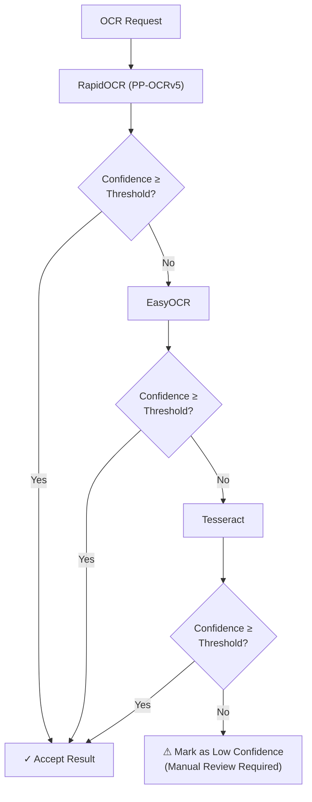

# Architecture / 系统架构设计

## Overview / 概述

Contract Document Comparator adopts a **layered pipeline architecture** with four main layers:

1. **Interface Layer** — CLI, Streamlit Web UI, FastAPI REST API
2. **Core Pipeline Layer** — Document parsing, OCR, field extraction, comparison, export
3. **Infrastructure Layer** — Security, database, error handling, logging
4. **Extension Layer** — LLM integration, industry presets

## Architecture Diagram

### High-Level System Architecture (Mermaid)



### ASCII Architecture Diagram

```
┌─────────────────────────────────────────────────────────────┐
│                    INTERFACE LAYER                           │
│  ┌──────────┐  ┌──────────────┐  ┌──────────────────────┐   │
│  │   CLI    │  │  Streamlit   │  │  FastAPI REST        │   │
│  │ (main.py)│  │(app_streamlit│  │ (api_server.py)      │   │
│  └────┬─────┘  └──────┬───────┘  └──────────┬───────────┘   │
├───────┴───────────────┴──────────────────────┴───────────────┤
│                       CORE PIPELINE                          │
│                                                              │
│  ┌────────────────┐     ┌──────────────────┐                │
│  │  INPUT STAGE   │     │  PROCESS STAGE   │                │
│  │  ┌──────────┐  │     │  ┌────────────┐  │                │
│  │  │PDF→Image │  │     │  │   Field    │  │                │
│  │  │(fitz)    │──┼─────┼─▶│ Extractor  │  │                │
│  │  └──────────┘  │     │  │ (regex)    │  │                │
│  │  ┌──────────┐  │     │  └──────┬─────┘  │                │
│  │  │OCR Engine│  │     │         │        │                │
│  │  │(RapidOCR │──┼─────┼─────────┘        │                │
│  │  │→EasyOCR  │  │     │                  │                │
│  │  │→Tesseract│  │     │  ┌────────────┐  │                │
│  │  └──────────┘  │     │  │ Full-Text  │  │                │
│  │  ┌──────────┐  │     │  │ Diff       │  │                │
│  │  │Word/Excel│──┼─────┼─▶│ (diff-match│  │                │
│  │  │Parser    │  │     │  │  -patch)   │  │                │
│  │  └──────────┘  │     │  └──────┬─────┘  │                │
│  └────────────────┘     └─────────┼────────┘                │
│                                  │                          │
│  ┌────────────────┐     ┌────────┴────────┐                │
│  │ COMPARE STAGE  │     │   EXPORT STAGE  │                │
│  │  ┌──────────┐  │     │  ┌────────────┐  │                │
│  │  │  Field   │  │     │  │   TXT      │  │                │
│  │  │  Matcher │──┼─────┼─▶│   JSON     │  │                │
│  │  └──────────┘  │     │  │   DOCX     │  │                │
│  │  ┌──────────┐  │     │  │   XLSX     │  │                │
│  │  │  Excel   │  │     │  │   PDF      │  │                │
│  │  │  Diff    │──┼─────┼─▶│   ZIP      │  │                │
│  │  └──────────┘  │     │  └────────────┘  │                │
│  │  ┌──────────┐  │     │                  │                │
│  │  │  LLM     │  │     │                  │                │
│  │  │  Eval    │  │     │                  │                │
│  │  └──────────┘  │     │                  │                │
│  └────────────────┘     └──────────────────┘                │
├─────────────────────────────────────────────────────────────┤
│                   INFRASTRUCTURE LAYER                       │
│  ┌──────────┐  ┌────────────┐  ┌────────────────────────┐  │
│  │ Security │  │  Database  │  │  Error Handler         │  │
│  │ ├Auth     │  │ ├SQLite   │  │ ├StructuredLogger      │  │
│  │ ├RBAC     │  │ ├WAL mode │  │ ├AuditTrail (singleton)│  │
│  │ ├RateLimit│  │ ├Fernet   │  │ ├Graceful Degradation  │  │
│  │ ├Upload   │  │ ├Auto-    │  │ ├6 Exception Types     │  │
│  │ │Validator│  │ │cleanup  │  │ └────────────────────┘  │
│  │ └──────────┘  │ ├CRUD    │  │                        │
│  │ ┌──────────┐  │ └────────┘  │                        │
│  │ │  LLM     │  │            │                        │
│  │ │ Engine   │  │            │                        │
│  │ └──────────┘  └────────────┘                        │
│  ┌──────────────┐                                      │
│  │ Config System│                                      │
│  │ ├config.py   │                                      │
│  │ ├profiles.py │                                      │
│  │ └api_keys    │                                      │
│  └──────────────┘                                      │
└─────────────────────────────────────────────────────────┘
```

### Comparison Pipeline Flow (Mermaid)



### OCR Fallback Mechanism (Mermaid)



## Key Design Decisions

### 1. Multi-Engine OCR with Auto-Fallback

**Why:** Different OCR engines excel at different document types. RapidOCR (PP-OCRv5) provides the best Chinese text recognition, while EasyOCR handles multilingual content. Tesseract serves as a universal fallback.

**Architecture:**
```
ocr_engine.py
├── OCRProcessor (main orchestrator)
│   ├── RapidOCRProcessor (primary)
│   ├── EasyOCRProcessor (fallback 1)
│   └── TesseractProcessor (fallback 2)
├── ImagePreprocessor (OpenCV pipeline)
│   ├── denoise
│   ├── deskew
│   ├── binarize (Otsu + Sauvola)
│   └── quality_assess
└── ConfidenceScorer
```

**Fallback logic:** If primary engine's confidence < threshold for critical fields, automatically retry with next engine.

### 2. Field-Level vs Full-Text Comparison

The comparison engine operates at two levels:

- **Field-Level** (`comparator.py`): Extracts structured fields (amounts, dates, IDs) and compares them with intelligent normalization (number tolerance, date unification, keyword overlap)
- **Full-Text** (`full_text_diff.py`): Uses Google's diff-match-patch for character-level diff, then classifies each diff chunk by risk level

### 3. Dual-Provider LLM Strategy

**Why:** Local LLM (Ollama) provides privacy and low latency, while Claude API provides superior semantic understanding for complex cases.

**Architecture:**
```
User Request
    │
    ├─→ [Ollama available?] ─Yes─→ Local Model (qwen3.5-0.8b)
    │                                   │
    │                                   └─→ Result acceptable? ─No─→
    │                                                              │
    └─→ [Claude API key set?] ─Yes─────────────────────────────────┘
                                        │
                                        └─→ Claude API (claude-sonnet-4)
```

### 4. Security-First Design

Security is embedded at every layer:

- **Transport:** API Key HMAC-SHA256 signing
- **Storage:** Fernet encryption for sensitive fields
- **Input:** File upload validation (magic bytes), input sanitization (XSS/SQLi/command injection)
- **Output:** SensitiveDataMasker for 5 data types
- **Audit:** Tamper-evident audit trail with hashing

### 5. Three UI Implementations

Each UI targets a different use case:

| UI | Use Case | Key Feature |
|----|----------|-------------|
| CLI | Automation, CI/CD | Headless operation, scriptable |
| Streamlit | Interactive analysis | Visual diff, drag-drop files |
| FastAPI | Production service | 20+ REST endpoints, RBAC, rate limiting |

## Data Flow

### Comparison Pipeline

```
Input Files
    │
    ▼
┌─────────────────────────────────┐
│ Document Parsing                │
│ PDF → Image (PyMuPDF)           │
│ Image → Text (OCR Engine)       │
│ Word → Text (python-docx)       │
│ Excel → Cells (openpyxl)        │
└─────────────┬───────────────────┘
              │
              ▼
┌─────────────────────────────────┐
│ Field Extraction                │
│ Regex patterns for:             │
│ • Amounts (numeric + Chinese)   │
│ • Dates (multiple formats)      │
│ • Contract IDs                  │
│ • Party Names                   │
│ • Key Terms                     │
└─────────────┬───────────────────┘
              │
              ▼
┌─────────────────────────────────┐
│ Comparison Engine               │
│ • Field-level matching          │
│ • Full-text diff                │
│ • LLM semantic evaluation       │
│ • Risk classification           │
└─────────────┬───────────────────┘
              │
              ▼
┌─────────────────────────────────┐
│ Report Generation               │
│ • Collect all diffs             │
│ • Apply confidence thresholds   │
│ • Classify risk levels          │
│ • Generate export artifacts     │
└─────────────────────────────────┘
```

## Module Dependencies

```
main.py
  ├── config.py
  ├── pdf_processor.py → ocr_engine.py
  ├── word_parser.py
  ├── field_extractor.py
  ├── comparator.py → full_text_diff.py
  └── report_generator.py

api_server.py
  ├── config.py
  ├── database.py
  ├── auth.py → security.py
  ├── comparator.py
  ├── excel_comparator.py
  ├── report_exporter.py
  ├── error_handler.py
  └── llm_engine.py

app_streamlit.py
  ├── config.py
  ├── database.py
  ├── auth.py → security.py
  ├── comparator.py
  ├── excel_comparator.py
  ├── report_exporter.py
  ├── error_handler.py
  └── llm_engine.py
```
